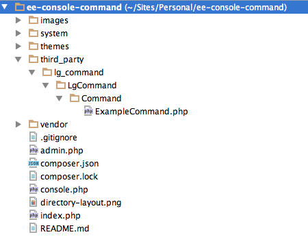

EECMS Addon Console Commands
============================

First crack at creating a console command that bootstraps eecms.

This code assumes:

* You know how to use composer
* You've installed and configured ExpressionEngine using the standard install layout:

EE Bootstrap
------------

[bootstrap-ee2.php](https://github.com/rsanchez/ExpressionEngine-Bootstrap) created by [rsanchez](https://github.com/rsanchez).
